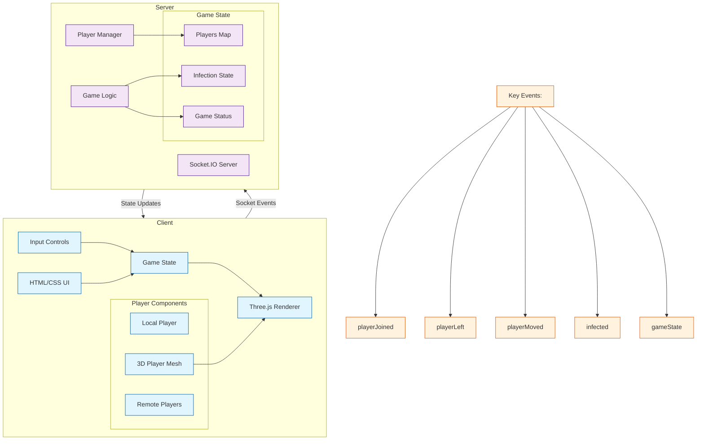

# Vibe Game

A chill multiplayer web game where players can hang out and move around in a 3D space.

## Architecture



## Features

- Instant play - no downloads required
- Multiplayer support
- Simple and intuitive controls
- Real-time player movement

## Setup

1. Install dependencies:
```bash
npm install
```

2. Start the server:
```bash
npm start
```

3. Open your browser and navigate to `http://localhost:3000`

## Controls

- Arrow Keys: Move around
- Q/E: Rotate left/right

## Development

To run the server in development mode with auto-reload:
```bash
npm run dev
``` 